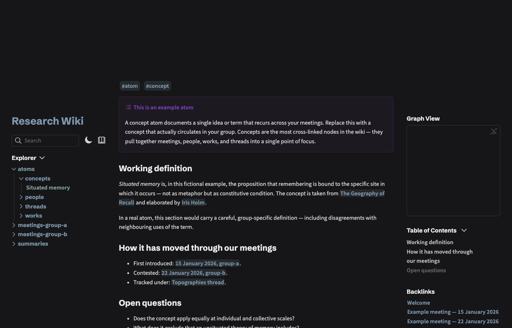

# Quartz Research Wiki — template

A starter for research groups, seminars, and reading clusters who want to publish their meetings, summaries, and cross-referenced notes as a searchable, linked website.



It is a configured fork of [Quartz v4](https://quartz.jzhao.xyz) by [Jacky Zhao](https://jzhao.xyz) — a free, open-source static-site generator that turns a folder of Markdown notes into a static HTML site with backlinks, full-text search, and a graph view. The source files stay ordinary Markdown, readable in any text editor or in [Obsidian](https://obsidian.md). MIT-licensed; no vendor lock-in.

## What this template adds on top of Quartz

- An opinionated `content/` structure for research groups: meetings → summaries → atoms (people, works, concepts, threads).
- One worked example per folder showing the YAML frontmatter + `[[wikilink]]` conventions.
- An `AGENTS.md` to guide AI assistants (Claude, ChatGPT, Gemini, etc.) editing the wiki in your house style.
- A `build.sh` script with two workflows — author directly in `content/`, or sync from an external notes vault.

## Quickstart

```bash
git clone <your-fork-of-this-repo>
cd <your-fork>
npm install
npx quartz build --serve         # local preview at http://localhost:8080
```

To customise:

1. Edit `quartz.config.ts` — set `pageTitle`, `baseUrl`, and theme colours.
2. Rename `content/meetings-group-a/` and `content/meetings-group-b/` to match your actual groups (or remove the second one).
3. Replace the example files in `content/` with your own meetings, summaries, and atoms.
4. Adjust `quartz.layout.ts` footer links to point to your institution.

## Building and deploying

This template uses [Netlify](https://netlify.com) by default, but Quartz builds a static `public/` directory that runs on any static host (GitHub Pages, Cloudflare Pages, your own server). To deploy:

```bash
./build.sh
```

Read `build.sh` first — it documents two patterns (direct authoring vs. external vault sync) and points to the line you need to edit.

## Folder structure

```
content/
  index.md                         landing page
  meetings-group-a/                weekly meetings of one group
  meetings-group-b/                weekly meetings of another group (delete if unused)
  summaries/                       condensed summaries of each meeting
  atoms/
    people/                        single-subject pages for people
    works/                         single-subject pages for books, articles, recordings
    concepts/                      single-subject pages for ideas / terms
    threads/                       ongoing multi-meeting lines of inquiry
```

The atoms pattern is the key idea: every recurring person, work, concept, or thread becomes its own short page, and every meeting or summary `[[wikilinks]]` to those atoms. Quartz's graph view then visualises how everything connects.

## Licence

MIT. See `LICENSE.txt`. Quartz itself © Jacky Zhao; this template's configuration and content scaffold © Paulo de Assis. You are free to use, modify, and republish this template — credit is welcome but not required.

## Credits

- [Quartz v4](https://quartz.jzhao.xyz) by [Jacky Zhao](https://github.com/jackyzha0) — the underlying engine.
- Configuration and research-group scaffold by [Paulo de Assis](https://github.com/MetamusicX).
